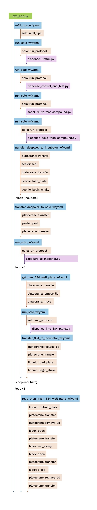

# Next-gen Environmental Factor Assessment (Ames Test) Experiment Application

## Project Overview

* To improve human health, we need
to better understand:
    * Do chemical compounds impact certain parts
    of the genome?
    * Are certain genes more susceptible
    to these impacts?
    * Are there growth conditions that make
    these effects more likely?

* The Ames test—a standard approach to
evaluate chemical compounds’ mutagenic
and carcinogenic impacts on DNA—uses
bacteria as sentinels.

* Our array of biological constructs, low-cost
assays, and self-driving laboratories screen
impacts of environmental factors on
biological systems.

### Key Impacts

* We evaluate genomic toxicity models
and inform strategies for mitigation by:
    * Modelling effects of compounds
    and/or classes of compounds
    * Assaying compound representatives
    to validate and extend the model
    * Using the model to guide change in a
    compound’s intended non-biological
    function and mitigate biological effects

* Open science data produced will help us:
    * Understand dynamics of mutation
    at the genome scale
    * Predict downstream biological effects
    of novel materials to inform initial design

## MADSci Experiment Application
### Initial Labware Setup

Before running this experiment application, please place the correct labware at the locations specified below, paying attention the direction of the labware's A1 corner. 

| Location | Labware Type | Description | Contents |
| ----------- | ----------- | ---------- | --------|
| SOLO Position 1 | 48-well deepwell | exposure/indicator plate | columns 1-3 EMPTY, columns 4-6 loaded with 2.75mL reversion indicator in each well
| SOLO Position 3 | 96-well deepwell | dilution plate | EMPTY at start
| SOLO Position 4 | 96-well deepwell | DMSO, control compound, and test compound stock plate| DMSO stock in each well of column 1, control compound stock in well A2, and test compound stock in well A3
| SOLO Position 5 | 180uL filter tip box | filter tips |  | 
| SOLO Position 6 | 96-well deepwell | cell stock plate | cell stock in each well of column 1
| Stack 1 | 3x 384-well plates | 3, new 384-well assay plates with lids | EMPTY at start |

### Running Instructions

We run this experiment application on a Linux machine.  

1. Ensure the RAPID350 Workcell is running.

2. Open a terminal window. 
3. Clone the rapid350_applications repository 

    `git clone https://github.com/AD-SDL/rapid350_applications.git`

4. Navigate to the rapid350_applicatios/AMES_TEST direcory

    `cd rapid350_applications/AMES_TEST`

5. Run the MADSci experiment application

    `python exp_app.py`

### Experiment Application Steps

